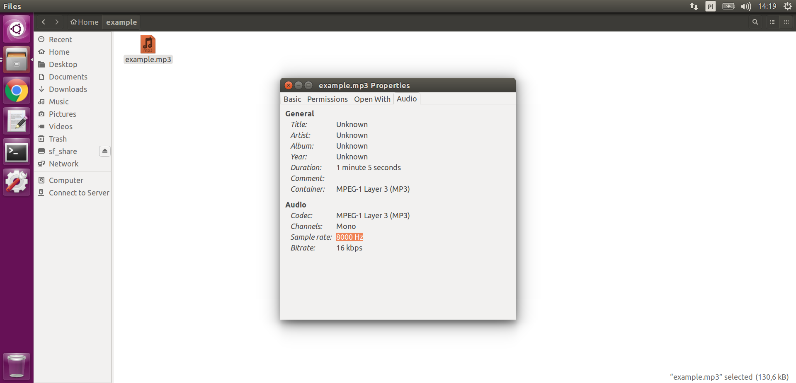

# QuickStart. Google Cloud Speech-to-Text API with Python
## Check sample rate of audio (measured in Hz)
You must know sample rate of your audio files like 8000 Hz, 16000 Hz, etc.<br>
In Ubuntu OS just click right button on your audio file and select `Properties-->Audio-->Sample rate`. See image below:



Example: 8000 Hz sample rate of audio on image above.

## Transcribe local audio file (1 minut max)
See [local.py](local.py) file or code below:
```python
import io

from google.cloud import speech_v1p1beta1 as speech

speech_file = 'example.mp3'
# Encoding: https://cloud.google.com/
# speech-to-text/docs/reference/rest/v1beta1/RecognitionConfig
encoding=speech.enums.RecognitionConfig.AudioEncoding.AMR
sample_rate_hertz=8000
# Language: https://cloud.google.com/
# speech-to-text/docs/languages
language_code='en-US'

client = speech.SpeechClient()
with io.open(speech_file, 'rb') as audio_file:
    content = audio_file.read()
audio = speech.types.RecognitionAudio(content=content)
config = speech.types.RecognitionConfig(
    encoding=encoding,
    sample_rate_hertz=sample_rate_hertz,
    language_code=language_code,
    # Enhanced models are only available to projects that
    # opt in for audio data collection.
    use_enhanced=True,
    # A model must be specified to use enhanced model.
    model='phone_call',
    profanity_filter=False,
    enable_automatic_punctuation=True,
    enable_word_confidence=True)
response = client.recognize(config, audio)
for i, result in enumerate(response.results):
    alternative = result.alternatives[0]
    print('-' * 20)
    print('First alternative of result {}'.format(i))
    print('Transcript: {}'.format(alternative.transcript))
```

## Transcribe audio file from Google Storage (longer that 1 minute)
See [storage.py](storage.py) file or code below:
```python
from google.cloud import speech_v1p1beta1 as speech

uri = 'gs://examplebucket/example.mp3'
# Encoding: https://cloud.google.com/
# speech-to-text/docs/reference/rest/v1beta1/RecognitionConfig
encoding='AMR'
sample_rate_hertz=8000
# Language: https://cloud.google.com/
# speech-to-text/docs/languages
language_code='en-US'

client = speech.SpeechClient()
operation = client.long_running_recognize(
        audio=speech.types.RecognitionAudio(uri=uri),
        config=speech.types.RecognitionConfig(
                encoding=encoding,
                sample_rate_hertz=sample_rate_hertz,
                language_code=language_code,
                use_enhanced=True,
                model='phone_call',
                profanity_filter=False,
                enable_automatic_punctuation=True,
                enable_word_confidence=True))
op_result = operation.result()
for result in op_result.results:
    for alternative in result.alternatives:
        print('=' * 20)
        print(alternative.transcript)
        print(alternative.confidence)
```
